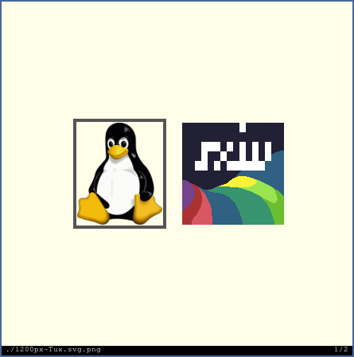

**Simple X Image Viewer**

This is my fork of sxiv. I created this because a lot of features I found useful were spread around multiple forks of the [main repo](https://github.com/muennich/sxiv). C is not my main language (but I can code a bit with it), thats why you will probably see that most of the additions are from 3rd parties. Contributions are more than welcome 🙃.


Features
--------
_Those with a ``new`` before the feature are additions compared to the main repo_

* Basic image operations, e.g. zooming, panning, rotating
* Customizable key and mouse button mappings (in *config.h*)
* Thumbnail mode: grid of selectable previews of all images
* Ability to cache thumbnails for fast re-loading
* Basic support for multi-frame images
* Load all frames from GIF files and play GIF animations
* Display image information in status bar
* _(new)_ Load all images on parent directory
* _(new)_ Partial svg support (see [known issues](#known-issues) for more information)
* _(new)_ View images from URL
* _(new)_ Full webp support
* _(new)_ Start from file
* _(new)_ Configurable title
* _(new)_ Configurable bar colors


Screenshots
-----------

**Image mode:**


**Thumbnail mode:**




Dependencies
------------

sxiv requires the following software to be installed:

  * Imlib2
  * X11
  * Xft
  * freetype2
  * fontconfig
  * librsvg (optional, disabled with `HAVE_CAIRO_SVG=0`)
  * cairo (optional, disabled with `HAVE_CAIRO_SVG=0`)
  * giflib (optional, disabled with `HAVE_GIFLIB=0`)
  * libexif (optional, disabled with `HAVE_LIBEXIF=0`)
  * libwebp (optional, disabled with `HAVE_LIBWEBP=0`)
  * curl (optional, disabled with `HAVE_LIBCURL=0`)

Please make sure to install the corresponding development packages in case that
you want to build sxiv on a distribution with separate runtime and development
packages (e.g. *-dev on Debian).


Building
--------

sxiv is built using the commands:

    $ make
    # make install

Please note, that the latter one requires root privileges.
By default, sxiv is installed using the prefix "/usr/local", so the full path
of the executable will be "/usr/local/bin/sxiv".

You can install sxiv into a directory of your choice by changing the second
command to:

    # make PREFIX="/your/dir" install

The build-time specific settings of sxiv can be found in the file *config.h*.
Please check and change them, so that they fit your needs.
If the file *config.h* does not already exist, then you have to create it with
the following command:

    $ make config.h


Usage
-----

Please see the [man page](http://GRFreire.github.io/sxiv/sxiv.1.html) for
information on how to use sxiv.


Configuring
-----------
```man
The following X resources are supported:

background
      Color of the window background

foreground
      Color of the window foreground

bar    Color of the bar background

text   Color of the bar foreground

font   Name of Xft bar font

titlePrefix
      Any string literal to be used as the window title prefix.

titleSuffix
      The format of the window title suffix.

          Value  Format
          0      Basename of file
          1      Basename of directory
          2      Full path to file
          3      Full path to directory
          4      Empty string

Please see xrdb(1) on how to change them.
```

Download
--------------------

You can [browse](https://github.com/GRFreire/sxiv) the source code repository
on GitHub or get a copy using git with the following command:

    git clone https://github.com/GRFreire/sxiv.git


Known Issues
------------
- Currently SVG support is unstable (more information on [issues/10](issues/10)), therefore it is disabled by default. You can enable it with ``HAVE_CAIRO_SVG=1`` when building.


Changelog & Stable releases
---------------------------
You can see changelog and stable releases [here](changelog.md)
