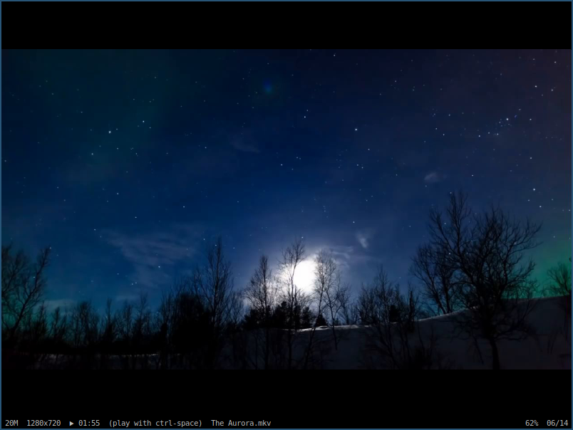

**Simple X Image Viewer**

The sole purpose of sxiv is to be the perfect image viewer for me. It is free
software so that you can use it and modify it for your needs. Please file a bug
report if something does not work as documented or expected. Contributions are
welcome but there is no guarantee that they will be incorporated.

**IMPORTANT**

This repo is a fork of the [main sxiv repo](https://github.com/muennich/sxiv). Below are the reasons this fork exist.

SXIV Main Features
--------

* Basic image operations, e.g. zooming, panning, rotating
* Customizable key and mouse button mappings (in *config.h*)
* Thumbnail mode: grid of selectable previews of all images
* Ability to cache thumbnails for fast re-loading
* Basic support for multi-frame images
* Load all frames from GIF files and play GIF animations
* Display image information in status bar

Fork Features
-------------

Here are the key points that diverge from the main repo

* Video support
* Navigate with arrows when not zoomed
* Logarithmic zoom steps
* Fit image zoom by default
* Start with a file name (`-F` option)
* Match bar colors
* Window titles match the bar
* Square thumbnails [patch](https://github.com/i-tsvetkov/sxiv-patches/blob/master/sxiv-square-thumbnails.patch) by i-tsvetkov
* SVG support [patch](https://github.com/muennich/sxiv/pull/440) by Dhruv Vanjari

Screenshots
-----------

**Image mode:**

**Video mode:**

**Thumbnail mode:**

Dependencies
------------

sxiv requires the following software to be installed:

  * Imlib2
  * X11
  * Xft
  * freetype2
  * fontconfig
  * giflib (optional, disabled with `HAVE_GIFLIB=0`)
  * libexif (optional, disabled with `HAVE_LIBEXIF=0`)
  * libmagic (optional, disabled with `HAVE_LIBMAGIC=0`)
  * ffmpegthumbnailer for video thumbnails

Please make sure to install the corresponding development packages in case that
you want to build sxiv on a distribution with separate runtime and development
packages (e.g. *-dev on Debian).

Building
--------

sxiv is built using the commands:

    $ make
    # make install

Please note, that the latter one requires root privileges.
By default, sxiv is installed using the prefix "/usr/local", so the full path
of the executable will be "/usr/local/bin/sxiv".

You can install sxiv into a directory of your choice by changing the second
command to:

    # make PREFIX="/your/dir" install

The build-time specific settings of sxiv can be found in the file *config.h*.
Please check and change them, so that they fit your needs.
If the file *config.h* does not already exist, then you have to create it with
the following command:

    $ make config.h

Usage
-----

Please see the man page for information on how to use sxiv.

